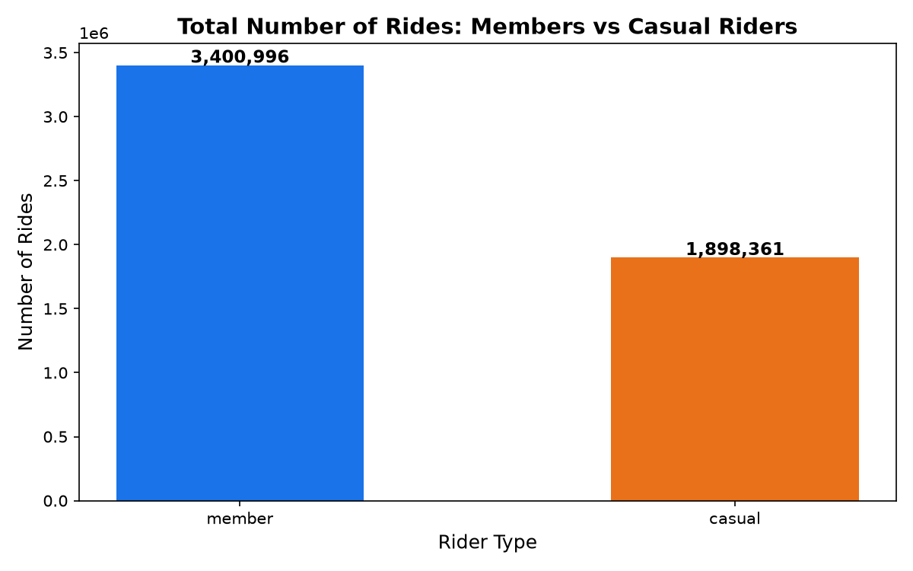
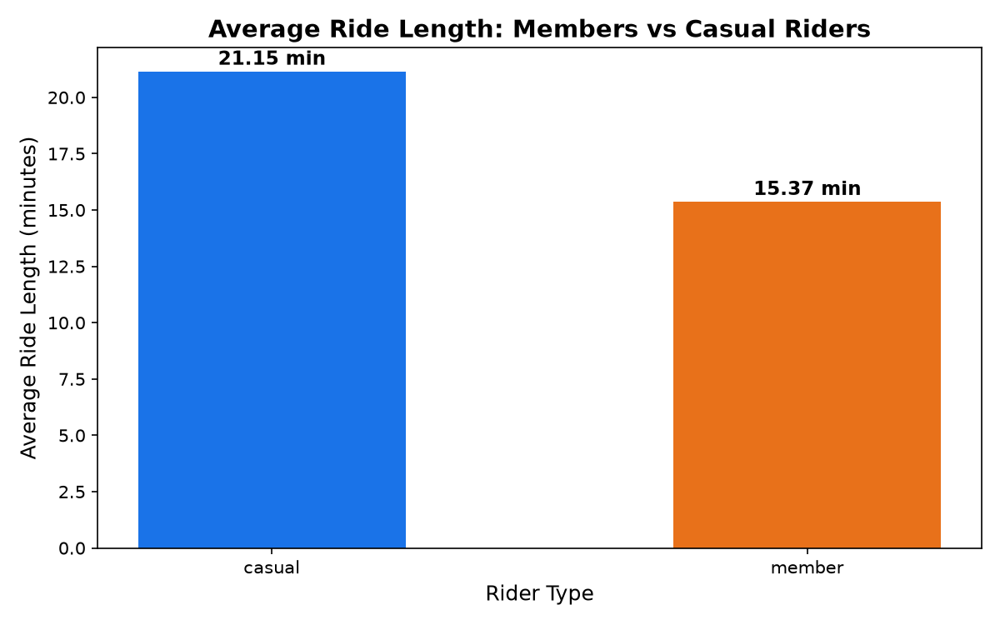
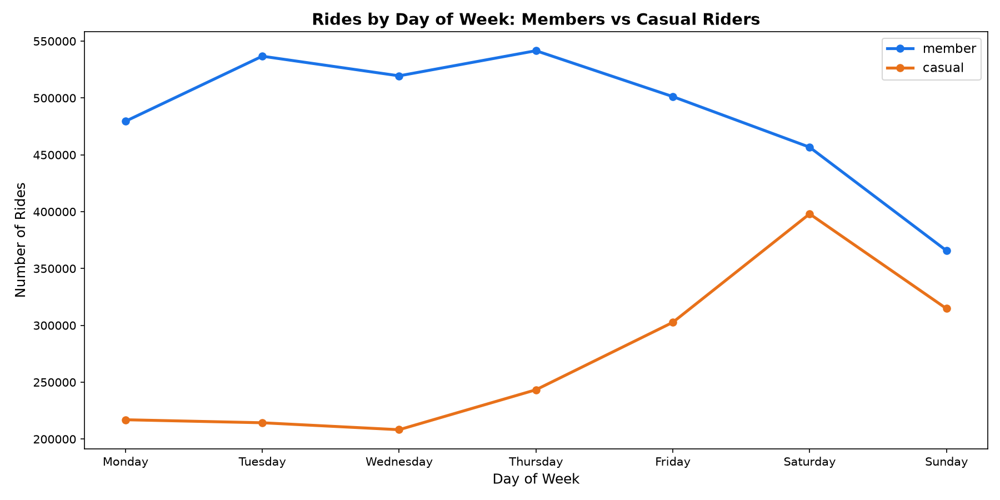
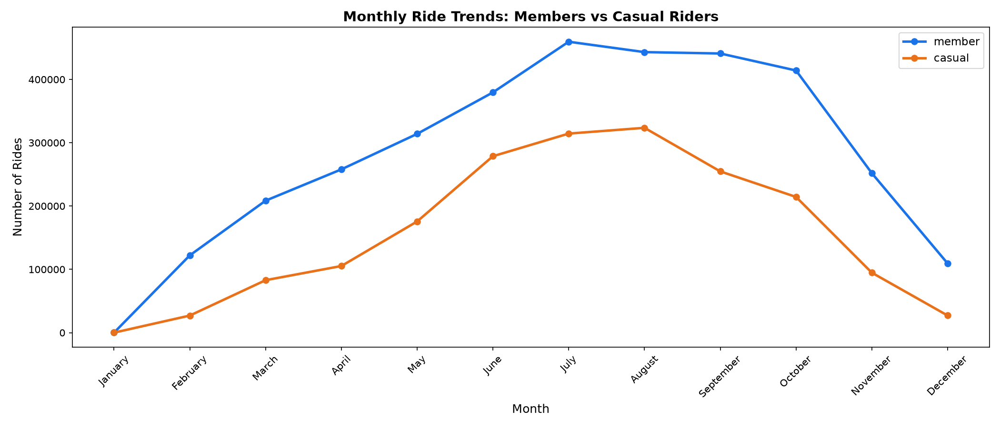
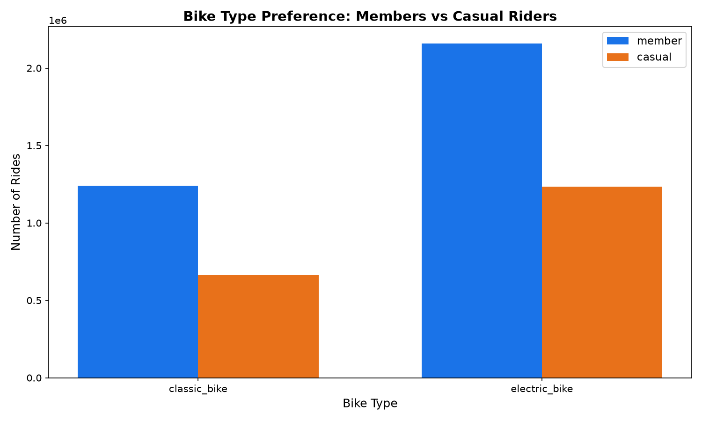
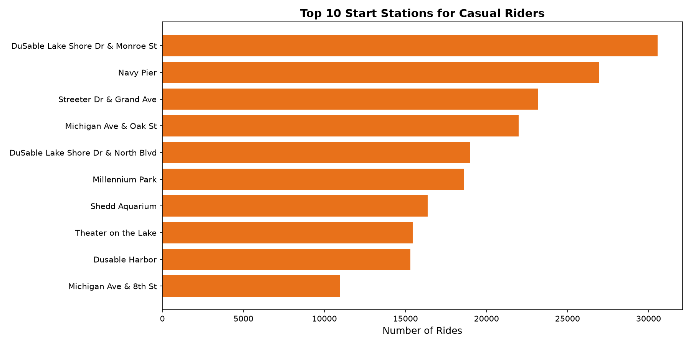
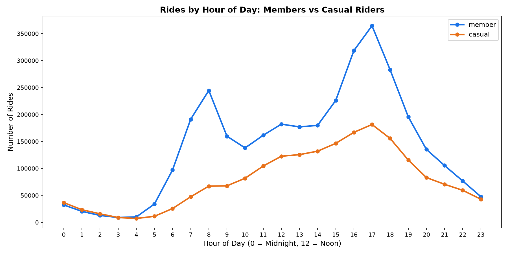

# Cyclistic Bike Share Analysis
## Google Data Analytics Capstone Project — Cyclistic Bike Share Case Study

## Project Overview
This project analyzes 12 months of Cyclistic bike-share trip data (2025) 
to understand how annual members and casual riders use bikes differently. 
The goal is to provide data-driven recommendations to convert casual 
riders into annual members.

## Business Question
**How do annual members and casual riders use Cyclistic bikes differently?**

## Tools Used
- **Excel** — Initial data exploration, ride_length and day_of_week calculations
- **Python (Pandas, Matplotlib, Seaborn)** — Full 12-month analysis and visualizations

## Dataset
- 12 months of Cyclistic trip data (January 2025 — December 2025)
- 5,299,357 clean ride records after data cleaning
- Source: Motivate International Inc.
- Downloaded from Amazon AWS server

## Key Findings
1. Members take more rides (3.4M) but casual riders ride longer on average
2. Members peak on weekdays (Tuesday/Thursday) → commuter behaviour
3. Casual riders peak on weekends (Saturday) → leisure behaviour
4. Both groups are most active in July and August
5. Both groups prefer electric bikes

## Top 3 Recommendations
1. **Weekend Membership Plan** — Offer a cheaper weekend-only membership 
   targeting casual riders who ride mostly on weekends
2. **Summer Marketing Campaign** — Run membership promotions in July and 
   August when casual riders are most active
3. **Station Based Marketing** — Place ads at top 10 casual rider stations 
   where they are already engaged with the service
4. **Deploy More Bikes at Peak Hours**
   Deploy additional classic and electric bikes during peak hours:
   - Weekday mornings (7AM–9AM) and evenings (5PM–7PM) for member commuters
   - Weekend afternoons for casual leisure riders
   This ensures bike availability when demand is highest, improving 
   experience for both groups and reducing the chance of casual riders 
   leaving due to unavailability.

## Visualizations

## Project Structure
| File | Description |
|---|---|
| `Cyclistic_Analysis.ipynb` | Main Python analysis notebook |
| `chart1_total_rides.png` | Total rides — members vs casual |
| `chart2_avg_ride_length.png` | Average ride length comparison |
| `chart3_day_of_week.png` | Rides by day of week |
| `chart4_monthly_trends.png` | Monthly ride trends |
| `chart5_bike_type.png` | Bike type preference |
| `chart6_top_stations.png` | Top 10 casual rider stations |
| `chart7_peak_hours.png` | Peak hours of the day |
| `README.md` | Project documentation |

---

## 👤 Author

**Soham Bhagwat**
- GitHub: [@Soham-data](https://github.com/iam-soham)

---
